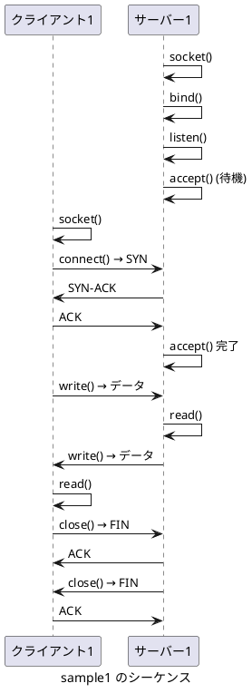

# sample1

```plantuml
@startuml sample1 のシーケンス
caption sample1 のシーケンス

participant "クライアント1" as C
participant "サーバー1" as S

S -> S: socket()
S -> S: bind()
S -> S: listen()
S -> S: accept() (待機)

C -> C: socket()
C -> S: connect() → SYN
S -> C: SYN-ACK
C -> S: ACK
S -> S: accept() 完了

C -> S: write() → データ
S -> S: read()
S -> C: write() → データ
C -> C: read()

C -> S: close() → FIN
S -> C: ACK
S -> C: close() → FIN
C -> S: ACK

@enduml
```
