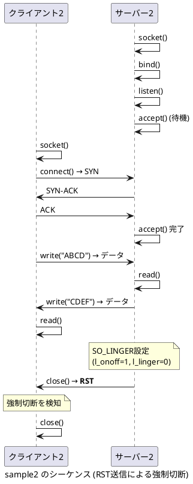

# sample2



## 説明

sample2では、サーバー側が**RST（リセット）パケット**による強制切断を行います。

### 通常のclose（sample1）との違い

- **sample1（正規のclose）**: 4-wayハンドシェイク（FIN → ACK → FIN → ACK）で丁寧に接続を終了
- **sample2（RST送信）**: サーバーが一方的にRSTパケットを送信して接続を強制終了

### RST送信の実装

サーバー側で`SO_LINGER`ソケットオプションを以下のように設定：

```c
struct linger so_linger;
so_linger.l_onoff = 1;   // lingerを有効化
so_linger.l_linger = 0;  // タイムアウト0秒 = RST送信
setsockopt(client_fd, SOL_SOCKET, SO_LINGER, &so_linger, sizeof(so_linger));
close(client_fd);
```

### RSTパケットの特徴

- 未送信データを破棄
- TIME_WAIT状態をスキップ
- 接続を即座に終了
- クライアント側でエラー（Connection reset by peer）が発生する可能性
