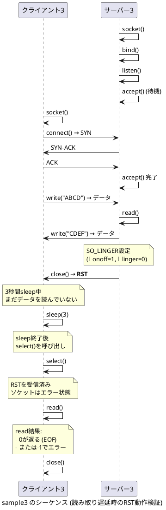

# sample3



## 検証目的

**クライアントが読み取りを遅延させた場合、サーバーのRST送信がどう影響するかを検証**

### 検証シナリオ

1. クライアントが "ABCD" を送信
2. サーバーが "CDEF" を送信（受信バッファに格納される）
3. **サーバーがRSTパケットを送信して強制切断**
4. クライアントは3秒間sleep（まだデータを読み取っていない）
5. sleep後、クライアントがselect()とread()を呼び出す

### 期待される動作

#### RSTパケットの影響

- **RSTパケット受信時**: TCPスタックはソケットをエラー状態にする
- **受信バッファのデータ**: RSTにより破棄される可能性がある（実装依存）

#### クライアント側の挙動

以下のいずれかの動作が想定される：

**パターン1: データが読める場合**
```
送信: ABCD
3秒待機中...
読み取り開始
受信: CDEF
```
- 受信バッファのデータがRST前に到着していれば読める可能性がある
- その後のread()でエラーまたはEOFを検知

**パターン2: 即座にエラー**
```
送信: ABCD
3秒待機中...
読み取り開始
接続が閉じられました
```
または
```
read failed: Connection reset by peer
```
- RSTによりソケットがエラー状態になり、データが読めない
- read()が0 (EOF)または-1 (エラー)を返す

### sample2との違い

- **sample2**: クライアントがすぐに読み取りを試みる
  - データを読める可能性が高い

- **sample3**: クライアントが3秒遅延してから読み取りを試みる
  - RSTの影響を受けやすい
  - 受信バッファのデータが破棄される可能性がある

### 実行方法

```bash
# ビルド
make

# ターミナル1でサーバー起動
./server3

# ターミナル2でクライアント実行
./client3
```

### tcpdumpでの確認

```bash
sudo tcpdump -i lo -nn 'port 8083'
```

RSTパケットのタイミングとクライアントの読み取りタイミングを確認できる。

### 重要な知見

この実験により、以下を理解できる：

1. **RSTパケットの破壊力**: 正規のFINと違い、RSTは受信バッファのデータを破棄する可能性がある
2. **タイミングの重要性**: クライアントの読み取りタイミングによって結果が変わる
3. **実装依存性**: OSやTCPスタックの実装により動作が異なる可能性がある
